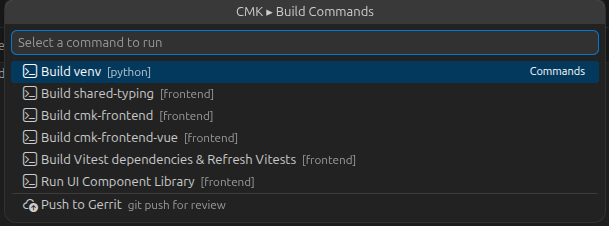

# CMK Dev Tools for VS Code

VSCode extension for the Checkmk repository — language profiles, build commands, IDE setup, code snippets, file templates, and build status detection.

## Why

Checkmk uses Bazel as its build system. Some packages (`cmk-shared-typing`, `cmk-frontend`) are generated at build time and not available on disk until built. This breaks IDE features like test discovery, import resolution, and type checking. This extension bridges that gap by:

- **Language profiles** — enable/disable Python, UI, and Rust tooling with one click
- Exposing Bazel build commands in the command palette and status bar
- Auto-detecting stale build targets and notifying you
- Automating extension installation and settings configuration per language/domain
- Managing OMD development sites and exposing Unix sockets via TCP proxies
- Providing code snippets and file templates for common Checkmk patterns

## Getting Started

### 1. Install the extension

**Via Bazel** (recommended):

```sh
bazel build //.ide/vscode:vsix
code --install-extension bazel-bin/.ide/vscode/cmk-vscode.vsix --force
```

**Manual** (from source):

```sh
cd .ide/vscode
npx @vscode/vsce package --no-dependencies -o cmk-vscode.vsix
code --install-extension cmk-vscode.vsix --force
```

Reload VS Code after installation (`Ctrl+Shift+P` → "Developer: Reload Window").

### 2. Run IDE Setup

F1 → `CMK ▸ IDE: Setup (Install + Configure)` — select the families matching your work (Python, UI, Rust, etc.). Required families (Bazel, General) are included automatically.

### 3. Build targets

Check the status bar — click the CMK indicator to build any stale targets. At minimum:

- **Python work:** Build venv
- **UI work:** Build Vitest dependencies & Refresh Vitests

### 4. Verify

Open the Checkmk sidebar (activity bar icon) — the **Environment** section shows versions and build status. The **IDE Health** section confirms settings and extensions are correctly configured.

## Features

### 1. Language Profiles

Three status bar buttons (**Py**, **UI**, **Rs**) let you enable or disable language tooling per domain. Click a button to toggle the profile. This reduces resource usage by stopping language servers and disabling extension features you don't need.


| Profile         | What it controls                                                                                 | Disable behavior                                                                          |
| --------------- | ------------------------------------------------------------------------------------------------ | ----------------------------------------------------------------------------------------- |
| **Py** (Python) | Pylance language server, mypy daemon, interpreter resolution, Python snippets, Bazel test runner | Sets `python.languageServer: "None"`, `mypy.enabled: false`. Kills running dmypy daemons. |
| **UI**          | ESLint, Stylelint, Prettier, prettier config watcher                                             | Sets `eslint.enable: false`, `stylelint.enable: false`, `prettier.enable: false`          |
| **Rs** (Rust)   | rust-analyzer language server                                                                    | Sets `rust-analyzer.initializeStopped: true`. Sends `rust-analyzer.stopServer` command.   |

**Status indicators:**

All enabled:  | All disabled: 

| Icon    | Meaning                                      |
| ------- | -------------------------------------------- |
| `○ Py`  | Profile inactive — language tooling disabled |
| `✓ Py`  | Profile active and healthy                   |
| `⚠ Py` | Profile active but has stale build targets   |
| `⟳ Py`  | Profile switching (loading)                  |

Profiles are persisted in `cmk.activeProfiles` in `.vscode/settings.json` and restored on reload. When a profile is disabled, its disable-settings are written to workspace settings so the corresponding extensions stop their heavy work (language servers, linters, etc.). When re-enabled, those settings are removed so the extensions resume normal operation.

**Default state:** Python and UI are enabled by default on first use. Rust is disabled by default.

### 2. Profile Detector

The extension monitors which files you edit and suggests enabling or disabling language profiles based on your activity. For example, if you haven't touched a Python file in 30 minutes, it suggests disabling the Python profile to free resources. Conversely, opening a `.py` file while the Python profile is off triggers an enable suggestion.

Configurable via:

- `cmk.profileDetector.enabled` — toggle the detector on/off (default: on)
- `cmk.profileDetector.inactivityMinutes` — inactivity threshold before suggesting disable (default: 30)

### 3. Build Status Detection

The extension monitors build targets and shows their status in the status bar:

- `$(check) CMK` — all targets are up to date
- `$(warning) CMK (2)` — 2 targets need building

**What is monitored:**

| Target             | Stale when                                                                     |
| ------------------ | ------------------------------------------------------------------------------ |
| Python venv        | `.venv/` missing                                                               |
| shared-typing (TS) | Symlink to `cmk-frontend-vue/node_modules/cmk-shared-typing` missing or broken |
| shared-typing (PY) | `cmk/shared_typing` missing from venv site-packages                            |
| cmk-frontend       | `packages/cmk-frontend/dist` symlink missing or broken                         |
| mypy config        | `.vscode/.mypy.ini` missing                                                    |
| prettier config    | `.vscode/.prettier.config.cjs` missing                                         |

**Auto-refresh triggers:** extension activation, after CMK build tasks complete, source file changes in `packages/cmk-shared-typing/source/`, `packages/cmk-frontend/src/`, `requirements*.txt`, and git branch switches (`.git/HEAD`).

Click the status bar item to see stale targets and build commands in a QuickPick. When stale targets exist, a warning banner also appears at the top of the Environment sidebar section with a **Build All Stale** button.

### 4. Build Commands (`CMK ▸ Cmd:`)

Available via the command palette (F1) or by clicking the status bar. Build commands are only visible when the required extension family is installed.



| Command                                       | Description                                                                                                                                |
| --------------------------------------------- | ------------------------------------------------------------------------------------------------------------------------------------------ |
| `Build venv`                                  | `bazel run //:create_venv` — creates/updates the Python venv with all dependencies including generated packages.                           |
| `Build shared-typing`                         | Builds TS and PY types from `cmk-shared-typing` and symlinks the output into `cmk-frontend-vue/node_modules/`.                             |
| `Build cmk-frontend`                          | Builds `cmk-frontend` (webpack) and symlinks `dist/` into the package directory.                                                           |
| `Build cmk-frontend-vue`                      | Builds `cmk-frontend-vue` via Bazel.                                                                                                       |
| `Build Vitest dependencies & Refresh Vitests` | Builds shared-typing (TS) + cmk-frontend, creates symlinks, then refreshes the VSCode test explorer.                                       |
| `Run UI Component Library`                    | Starts the UI Component Library dev server via `ibazel`.                                                                                   |
| `Build All Stale`                             | Builds all targets that are currently stale, in sequence.                                                                                  |
| `Build Menu`                                  | Opens the QuickPick with all build commands (same as clicking the status bar).                                                             |
| `Refresh Build Status`                        | Manually re-checks all build targets.                                                                                                      |
| `Regenerate mypy config`                      | Regenerates `.vscode/.mypy.ini` from `pyproject.toml`, stripping options unsupported by the installed mypy version.                        |
| `Regenerate prettier config`                  | Regenerates `.vscode/.prettier.config.cjs` from `bazel/tools/prettier.config.cjs`, replacing `require()` with string-based plugin loading. |

### 5. Dashboard

The sidebar dashboard groups related information into collapsible webview sections.

#### Environment

Shows system tool versions (Python, Node.js, Bazel, Bazelisk, Docker, GCC) and build target status. Includes a system readiness indicator that checks for required tools and pyenv. The Python row has a **Rebuild** button. Stale build targets are listed below with Build/Regenerate buttons.

On first use, an **onboarding checklist** guides you through the initial setup steps: system prerequisites, venv build, and IDE configuration.

#### OMD Sites

Displays all detected OMD sites with live status. Each site header shows:

- **Play/Stop** button — starts or stops the site (contextual based on current state)
- **Terminal** button — opens a `sudo omd su <site>` console
- **Browser** button — opens the site in the browser (if port is configured)
- **Delete** button — removes the site (with confirmation)

Expanding a site shows individual service status with per-service start/stop/restart controls.

**Create Site:** If `cmk-dev-site` is installed, a **+** button in the OMD section title bar lets you create new sites. The extension also checks PyPI daily for `cmk-dev-site` updates and prompts to upgrade when a newer version is available.

**Socket Proxy:** F1 → `CMK ▸ OMD: Socket Proxy` exposes OMD Unix sockets (livestatus, Redis, mkeventd, rrdcached) as TCP ports on localhost via `socat`. This allows external tools (database clients, monitoring dashboards) to connect to site sockets without sudo. Active proxies are shown in the OMD section with their assigned ports.

**Authentication:** OMD commands require sudo. Click "Authenticate (YubiKey)" to cache credentials. A background keepalive extends the sudo cache for up to 1 hour.

#### Issues (Activity Bar Badge)

The activity bar icon shows a badge with the total number of issues across the workspace. The Issues view lists all detected problems:

- Stale build targets
- Settings mismatches
- Missing required extensions
- High-resource extensions that should be disabled (e.g. Python Environments)

Clicking an item navigates to the relevant dashboard section or opens the appropriate settings.

#### IDE Health

Combined view of settings mismatches, extension health per family, and extension version info.

**Version info** shows the installed extension version. When the workspace contains a newer version (e.g. after a branch switch), an update banner prompts to rebuild and install.

**Settings** are grouped by plugin family in collapsible accordion sections. Each family group shows:

- **Apply {Family}** button — fix all mismatches for that family
- Per-setting **Wrench** icon — apply a single setting
- Per-setting **Copy** icon — copy the full JSON key+value to clipboard
- **Apply All** button at the top — fix all mismatches across all families at once

If no workspace configuration files are found in `.ide/vscode/config/`, a warning banner is shown advising to evaluate extensions and settings independently.

**Extensions** are listed below with install status per family and per-extension install buttons.

### 6. IDE Setup (`CMK ▸ IDE:`)

Three unified commands with a family picker (multi-select QuickPick):

| Command                       | What it does                                               |
| ----------------------------- | ---------------------------------------------------------- |
| `Install Extensions`          | Install VSCode extensions for selected families            |
| `Configure Settings`          | Apply workspace/folder/user settings for selected families |
| `Setup (Install + Configure)` | Both in one step                                           |

Each opens a QuickPick where you select which families to include. Required families (Bazel, General) are locked and always included. Optional families can be toggled individually.

#### Extension families

| Family       | Extensions                                                                                                       | Required              |
| ------------ | ---------------------------------------------------------------------------------------------------------------- | --------------------- |
| **Bazel**    | `BazelBuild.vscode-bazel`                                                                                        | Yes (locked)          |
| **General**  | _(no extensions, settings only)_                                                                                 | Yes (locked)          |
| **Python**   | `ms-python.python`, `ms-python.vscode-pylance`, `charliermarsh.ruff`, `matangover.mypy`                          | No                    |
| **UI**       | `Vue.volar`, `dbaeumer.vscode-eslint`, `esbenp.prettier-vscode`, `stylelint.vscode-stylelint`, `vitest.explorer` | No                    |
| **Rust**     | `rust-lang.rust-analyzer`, `swellaby.vscode-rust-test-adapter`                                                   | No (not pre-selected) |
| **Markdown** | `davidanson.vscode-markdownlint`, `esbenp.prettier-vscode`                                                       | No                    |
| **cSpell**   | `streetsidesoftware.code-spell-checker`                                                                          | No (not pre-selected) |

#### Settings per family

Settings are applied at three scopes: **folder** (`.vscode/settings.json`), **workspace** (`.vscode/settings.json` for workspace-only settings), and **user** (`~/.config/Code/User/settings.json`).

The configure command shows a QuickPick with all new/changed settings where you can select which ones to apply.

| Family      | Key settings                                                                                                                                                                                  |
| ----------- | --------------------------------------------------------------------------------------------------------------------------------------------------------------------------------------------- |
| **Bazel**   | `bazel.buildifierExecutable` path                                                                                                                                                             |
| **General** | `editor.formatOnSave`, `git.branchProtection` for master/main, `files.watcherExclude` / `search.exclude` for bazel-\*, .venv, node_modules, cache dirs                                        |
| **Python**  | Ruff (formatter/linter on save, workspace scope), Pylance (analysis excludes, auto-import), pytest config, mypy (dmypy with auto-generated `.mypy.ini`), `pylint.enabled: false` (user scope) |
| **UI**      | Prettier (TS/JS/Vue/JSON/CSS formatter, auto-generated config from Bazel source), Stylelint, Vitest (root config, search pattern excludes), editor code actions on save                       |
| **Rust**    | rust-analyzer (linked projects for check-cert, check-http, cmk-agent-ctl, mk-oracle, mk-sql; clippy), format-on-save. Requires matching Rust toolchains installed via `rustup`.               |
| **cSpell**  | Spell checker with Checkmk-specific dictionary (`.vscode/.cspell/checkmk.dict.txt`), auto-copied on configure                                                                                 |

### 7. Code Snippets

Type the prefix in a Python file to insert boilerplate:

| Prefix              | Description                                                 |
| ------------------- | ----------------------------------------------------------- |
| `cmk-check-plugin`  | Agent-based check plugin with discovery and check functions |
| `cmk-agent-section` | Agent section with parse function                           |
| `cmk-form-spec`     | Check parameter form spec (v1 rulesets)                     |
| `cmk-special-agent` | Special agent with argument parsing                         |
| `cmk-metric`        | Graphing metric definition                                  |

All snippets include the Checkmk license header with the current year.

### 8. File Templates (`CMK ▸ New:`)

F1 → `CMK ▸ New: Create from Template` — scaffolds new files with boilerplate:

| Template                         | Creates                                                               |
| -------------------------------- | --------------------------------------------------------------------- |
| **Check Plugin**                 | `cmk/plugins/<name>/agent_based/check_plugin.py` + `agent_section.py` |
| **Special Agent**                | `cmk/plugins/<name>/special_agent/agent_<name>.py`                    |
| **Form Spec (Check Parameters)** | `cmk/plugins/<name>/rulesets/<name>.py`                               |

Prompts for the plugin name, creates the directory structure, and opens the first file.

### 9. Bazel Test Runner

Run Python tests via Bazel directly from the editor:

| Command                                      | Description                                  |
| -------------------------------------------- | -------------------------------------------- |
| `CMK ▸ Test: Run File (Bazel)`               | Run all tests in the current file            |
| `CMK ▸ Test: Run Function at Cursor (Bazel)` | Run the test function at the cursor position |

The test runner finds the Bazel target by walking up the directory tree for BUILD files. If no target is found locally, it falls back to `bazel query`. Results are shown in the terminal panel. Only available when the Python profile is active.

### 10. Gerrit Push

F1 → `CMK ▸ Push to Gerrit` pushes commits for Gerrit code review. It:

- Warns if you have uncommitted changes
- Warns if pushing from master/main
- Prompts for the target branch (defaults to `master`)
- Shows the number of commits to be pushed before confirming

Also available from the Tools section in the dashboard sidebar.

### 11. First-Run Wizard

On first activation, the extension detects whether basic workspace settings (e.g. `editor.formatOnSave`, `git.branchProtection`) are configured. If not, it shows an info notification offering to open the dashboard to get started with system setup, venv build, and IDE configuration. The prompt can be permanently dismissed via "Don't Ask Again".

## Typical workflows

### UI-only setup

In step 2, select only the UI family. Then run F1 → `CMK ▸ Cmd: Build Vitest dependencies & Refresh Vitests`.

### After a branch switch

Check the status bar — build any stale targets.

### Creating a new check plugin

F1 → `CMK ▸ New: Create from Template` → Check Plugin → enter plugin name.

## Known limitations

- **Pylance auto-import** suggests re-exports instead of barrel exports from `__init__.py`. mypy catches these via `no_implicit_reexport`.
- **mypy IDE config** (`.vscode/.mypy.ini`) is auto-generated from `pyproject.toml` on activation and when `pyproject.toml` changes. Options unsupported by the installed mypy version are automatically stripped. `follow_imports` is overridden to `normal` (required by dmypy). Regenerate manually via `CMK ▸ Cmd: Regenerate mypy config`.
- **Vitest** follows `bazel-*` symlinks during config discovery, causing errors. Mitigated by `vitest.configSearchPatternExclude`.
- **Prettier config** (`.vscode/.prettier.config.cjs`) is auto-generated from `bazel/tools/prettier.config.cjs`, replacing `require()` with string-based plugin loading. Regenerates on source change or via `CMK ▸ Cmd: Regenerate prettier config`.
- **ESLint** extension follows `bazel-*` symlinks into protected directories, causing permission errors. Needs `bazel-*/**` in eslint global ignores in `eslint.config.mjs` (not yet implemented).
- **Profile disable-settings** require the target extension to be installed. Settings for extensions that haven't activated yet (e.g., `rust-analyzer.initializeStopped`) are written via section-scoped configuration to avoid "not a registered configuration" errors.
- **dmypy cleanup** kills all dmypy daemons for the workspace when the Python profile is disabled. Orphaned daemons from previous sessions are cleaned up periodically while the profile is active.
- **Python Environments** (`ms-python.vscode-python-envs`) is detected as a high-resource extension that can cause performance issues. It respawns automatically after being stopped and cannot be disabled via settings — the Python extension re-launches it on activation. The Issues view warns when it is installed.
- Build commands require `bazel` on PATH — ensure linuxbrew or your Bazel installation is available.
