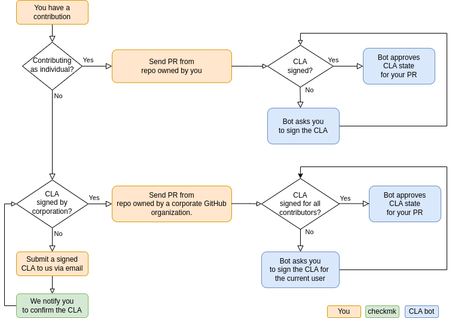

# Checkmk CLA Process

This project requires contributors to sign a Contributor License Agreement (CLA) before accepting any contributions. The most important reason for this is that we need to be able to dual license the software for the Raw Edition and the Enterprise Editions of Checkmk.
We have two processes for signing a CLA:
- Individual CLA (ICLA): this is for contributors who are contributing to the project as individuals, not as employees of a company.
- Corporate CLA (CCLA): this is for contributors who are contributing to the project as employees of a company. The CLA must be signed by someone who has the authority to legally bind the company, such as a manager, director, or officer.

The process works like this:

## Individual CLA Process

To sign the CLA and submit PRs as individual, please follow these steps:
1. Fork the project on GitHub.
2. Create a new branch for your changes.
3. Make your changes and commit them to your branch.
4. Create a pull request from your branch to the main branch of the project.
5. The CLA bot will automatically check if you have signed the CLA. If you have not, the bot will guide you through the process of signing it.
6. Once the bot confirms that you have signed the CLA, your pull request will be reviewed and considered for merging into the main branch.

In case the CLA bot process does not work for you, you can send the signed CLA to us via mail to cla@checkmk.com.

## Corporate CLA Process

To sign the CLA as a corporation, please follow these steps:
1. Have someone with the authority to legally bind the company sign the CLA.
2. Send the signed CLA via mail to cla@checkmk.com.
3. We'll notify you once we have confirmed the signed CLA.

After the CLA has been signed, you can submit PRs as corporation like this:
1. Fork the project on GitHub.
2. Make your changes and commit them to your branch.
3. Create a pull request from your branch to the main branch of the project. Ensure that the pull request is being made from a repository that has been assigned to the GitHub organization owned by the corporate.
4. The CLA bot will automatically check if all contributors have signed the CLA. If you have not, the bot will guide you through the process of signing it.
5. Once the bot confirms that you have signed the CLA, your pull request will be reviewed and considered for merging into the main branch.

In case the CLA bot process does not work for you, you can send the signed CLA to us via mail to cla@checkmk.com.

## FAQ

### I built something on my job and want to submit the contribution from my personal GitHub account. Is it enough to finish the individual CLA process?
If you are contributing to the project as an individual, and not as an employee of a company, then signing the Individual CLA is sufficient. However, if you are making contributions as an employee of a company, then you will need to have a corporate signed CLA. If your employer allows you to contribute to open source projects on your own time, then you can use the individual CLA process to cover those contributions.

### I contribute for my company, do I have to sign the CLAs?
If you are contributing to the project as an employee of a company, then your organization needs to sign the CLA together with you. Once the corporate CLA process is finished, we can accept your contributions. There is no need to go through the individual CLA process in addition.

If you have built the changes in your own time and are contributing to the project as an individual, then the individual CLA process is sufficient.

### In my job, I make contributions under the corporate signed CLA. How can I submit PRs under the individual CLA in my spare time?
If you are making contributions under the corporate signed CLA, and you additionally want to submit a contribution as an individual under the individual CLA, you will first need to ensure that you are allowed to do so. Your employer may have policies in place that prevent you from contributing to open source projects on your own time, or they may require you to contribute all of your work to the company.

If you are allowed to contribute to open source projects on your own time, and your contribution does not include any code or other materials that were developed on company time, then you can sign the Individual CLA and submit your contribution as an individual. However, if your contribution includes any code or other materials that were developed on company time, then you will need to submit it under the corporate signed CLA.

### What do I need to do as a contractor for a corporation?
If you are a contractor contributing to the project on behalf of a corporation, you will need to ensure that your contribution is covered by the CLA.

You may need to work with the legal team at the corporation to ensure that the appropriate agreements are in place before you can make contributions to the project. If you are not authorized to sign the CLA on behalf of the corporation, then you should work with the legal team to ensure that the appropriate individual or representative signs the agreement. Once the CLA is in place, you can make contributions to the project on behalf of the corporation.

If you make contributions on your own time, outside of your work as a contractor, then you can sign the Individual CLA and submit your contributions as an individual.

### What do I need to do in case I change companies and still want to contribute?
If you are an employee who has changed companies and you want to continue making contributions to the project, you will need to ensure that your new employer has a CLA signed. You should work with your new employer's legal team to ensure that the appropriate agreements are in place before making contributions to the project.

If you are making contributions on your own time, outside of your work as an employee, then you can keep using the Individual CLA and submit your contributions as an individual.