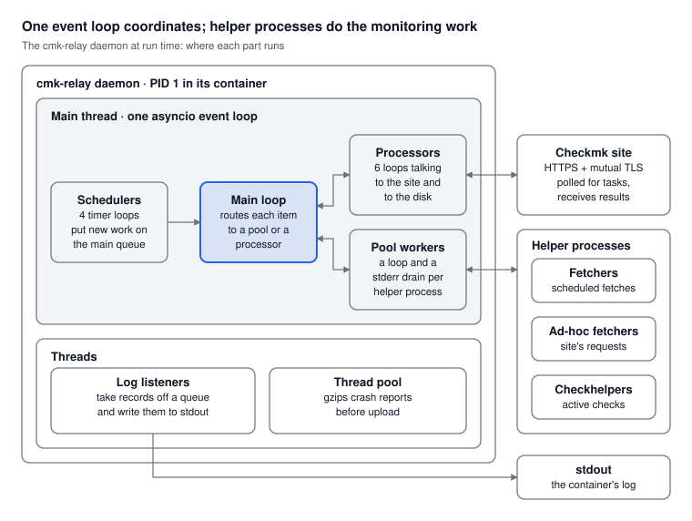
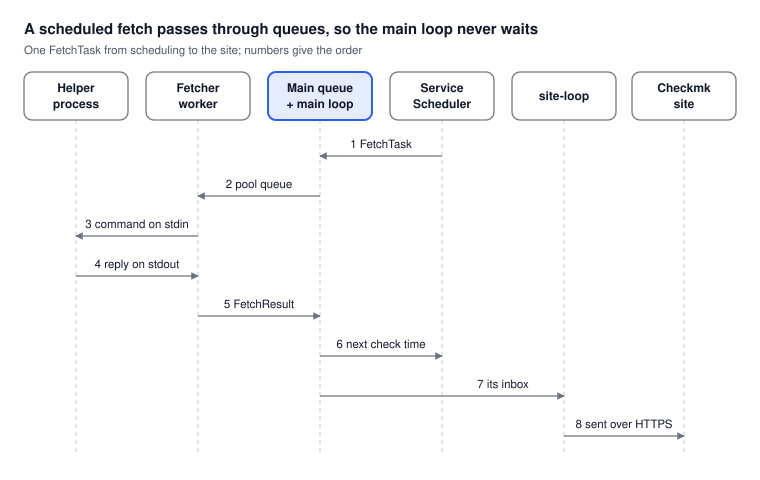
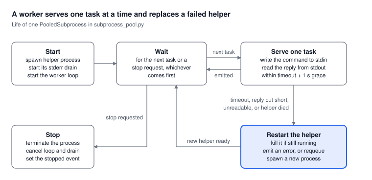

=====================================
Relay Engine Concurrency Overview
=====================================

The relay daemon is one process with one asyncio event loop that coordinates everything.
The monitoring work itself runs in pools of helper subprocesses, and threads appear only where blocking would stall the loop.

This page describes the current state of master.

At a glance
===========

Double arrows carry work both ways: results from the helpers, and the new config from the config loop, come back to the main queue.

- **Tasks** do all the coordination on one thread: 11 long-running loops plus 2 per helper process.
  They wait on queues, timers, pipes and HTTP.
- **Helper processes** do the monitoring work itself, in parallel: fetchers, ad-hoc fetchers and check helpers.
- **Threads** only take work that would block the loop: two log listeners and asyncio's thread pool.

The daemon's loop is ``asyncio.run(_daemon(...))`` in ``daemon.py``; its root task is the main loop described in the next section.
Every subcommand enters through ``cmk.relay.app:main``.
``rotate-certs``, ``submit-crashes`` and ``debug`` each run their own short ``asyncio.run(...)`` and exit; ``register`` is plain synchronous code.

How work flows
==============

All coordination runs through one ``asyncio.Queue``, the main queue (``main_queue.py``).
Whatever produces work puts it there.
The main loop at the end of ``_daemon`` takes everything queued at once (``read_batch``) and routes each item by its type.

Routing must stay fast, because every item waits behind the one being routed.
The main loop only puts items on other queues or makes short synchronous calls.
The one exception is applying a config, which it awaits inline (see `TaskGroups and the other asyncio tools`_).

Steps 1, 2, 5 and 7 are puts on a queue; step 6 is a plain synchronous call, safe because both sides run on the loop's thread.

Background loops
================

Besides the main loop, a running daemon has a fixed set of loops plus 2 per helper process.
Each is a ``while True`` coroutine started at boot that nobody awaits while it runs.

They come in two shapes:

- **Schedulers** wake on a timer and put new work on the main queue.
- **Processors** own an inbox, an ``asyncio.Queue``, plus one loop that drains it.
  Their ``dispatch()`` only puts on the inbox, and inboxes are unbounded, so the main loop never waits on a processor's I/O.

.. list-table::
   :header-rows: 1
   :widths: 25 10 20 45

   * - Task name
     - Kind
     - Wakes on
     - What it does
   * - ``ServiceScheduler``
     - scheduler
     - every ``host_scheduler_sleep``
     - Puts a ``FetchTask`` or ``ActiveCheckTask`` on the main queue for each due service; results come back through ``dispatch()``
   * - ``PollScheduler``
     - scheduler
     - every ``poll_sleep``
     - Asks the site for pending tasks and queues ad-hoc fetches, ad-hoc active checks, the newest config update and the site's version
   * - ``CertRotationScheduler``
     - scheduler
     - every ``cert_rotation_schedule``
     - Queues a ``CertRotationTask`` when the client certificate needs renewing
   * - ``RelayStatusScheduler``
     - scheduler
     - every ``relay_status_schedule``
     - Asks the site for this relay's status and logs it
   * - ``site-loop``
     - processor
     - its inbox
     - Sends results and errors to the site; drops the cached site client when a new config lands
   * - ``config-update-loop``
     - processor
     - its inbox
     - Unpacks a config archive, links it as latest, queues ``ApplyConfigTask``
   * - ``config-cleanup-loop``
     - timer
     - every 60 s by default
     - Deletes old config serials
   * - ``cert-rotation-loop``
     - processor
     - its inbox
     - Sends a CSR to the site and stores the new certificate
   * - ``site-version-update-loop``
     - processor
     - its inbox
     - Rewrites the site-version trigger file when the site's version changes, at most once per interval
   * - ``crashreport-cleanup-loop``
     - timer
     - every 60 s
     - Forwards crash reports to the site, then trims the directory to 5 MB
   * - ``<pool>-loop``
     - worker
     - its pool's queue
     - One per helper process: runs one task at a time on it (see `Subprocess pools`_)
   * - ``<pool>-stderr-drain-<pid>``
     - worker
     - the helper's stderr
     - Copies stderr to the debug log so the pipe never fills and blocks the helper

Pool names are ``fetcher``, ``adhoc-fetcher`` and ``checkhelper``.

**Start every loop with** ``create_background_task(coro, name=...)`` (``async_utils.py``), never a bare ``asyncio.create_task``.
It gives the task an empty ``contextvars`` context, so a loop started while one task is being handled does not stamp that task's log fields on every later line.
It writes no crash report, so a loop that dies is silent.
The schedulers and three processors still use a bare ``create_task`` on master.

Subprocess pools
================

The monitoring work runs in helper processes, so a slow or crashing check never touches the event loop.
Each of the three ``SubprocessPool`` instances owns a set of workers, and each worker drives exactly one helper process.

.. list-table::
   :header-rows: 1
   :widths: 25 45 30

   * - Pool
     - Runs
     - Size set by
   * - ``fetcher``
     - scheduled fetches (``FetchTask``)
     - ``num_fetchers``
   * - ``adhoc-fetcher``
     - fetches the site asks for (``AdHocFetchTask``)
     - ``num_adhoc_fetchers``
   * - ``checkhelper``
     - scheduled and ad-hoc active checks
     - ``num_checkhelpers``

- **One queue per pool, many workers.**
  Idle workers compete for the next task on the pool's queue.
  Each helper handles one task at a time, so a pool's concurrency is its number of workers.
- **Three moving parts per worker:**
  the helper process, the ``<pool>-loop`` task that feeds it, and the ``<pool>-stderr-drain-<pid>`` task that empties its stderr.
- **The wire.**
  A command goes to the helper's stdin, and the reply comes back on stdout as framed messages.
  The protocol classes in ``fetcher_protocol.py`` and ``checkhelper_protocol.py`` define the format and the helper's environment.
- **Failures.**
  On a timeout, a reply cut short, or an unreadable one, the worker kills the helper, emits an error for the task, and starts a new helper.
  Any other exception emits an error but keeps the helper, because the stream is still in step.
- **Resizing.**
  Scale-up starts the new workers in a TaskGroup.
  Scale-down asks workers to stop once idle and waits for them with ``gather``, so no task in flight is lost.

A task that arrives after its helper died while idle goes back on the queue instead of failing.

TaskGroups and the other asyncio tools
======================================

The engine uses ``asyncio.TaskGroup`` in two places, both where it must start several things at once and continue only when all have finished.

1. **Applying a config** (``_apply_config_update`` in ``daemon.py``).
   It resizes the three pools and replaces the service schedule concurrently.
   The main loop awaits it inline, so no other main-queue item is handled until the new config is fully in place.
2. **Scaling a pool** (``SubprocessPool._reconcile_pool``).
   It starts all new workers concurrently.

When one child of a TaskGroup raises, the group cancels its other children, waits for them, and raises an ``ExceptionGroup`` holding every child's exception.
Nothing catches that group in the main loop, so a failed config apply ends the engine; systemd restarts the container 10 s later (``Restart=always`` in ``install_relay.sh``).
The group's own traceback starts in asyncio internals, so it does not name the fault.

Threads
==========

The daemon uses threads in only two places, both to keep blocking work off the event loop.
Everything else runs in the loop's thread.

**Logging: two** ``QueueListener`` **threads** (``_setup_root_logger`` and ``_setup_app_logger`` in ``daemon.py``).

- One serves the root logger, used by third-party libraries at ``third_party_log_level``.
  The other serves the ``cmk.relay`` logger at the relay's own log level.
- On the loop side, a log call only puts the record on a queue, which never blocks.
  The listener thread does the slow part: formatting and writing to stdout, which is a pipe into the container runtime and can stall.
- The log context is captured on the loop side, before the hand-off.
  ``ContextInjectingFilter`` sits on the ``QueueHandler``, so it copies the current task's ``bound_contextvars`` fields into the record; the listener thread could not see them.

**Crash report upload:** ``asyncio.to_thread`` (``SiteClient.submit_crash``).
Compressing a crash report of several MB with gzip would freeze every loop, so it runs in asyncio's default thread pool.
An exception there is re-raised at the ``await`` in the calling task, like any other.

Blocking work that still runs on the loop today:

- Unpacking a config archive (``tarfile``, ``shutil.copytree``).
- Writing a crash report.

Both are short and rare.

Signals, cancellation and shutdown
==================================

The daemon has no orderly shutdown: ``SIGTERM`` ends it at once, and an unhandled error ends it through ``asyncio.run``.
After a crash, systemd starts it again 10 s later.

- ``SIGTERM`` calls ``os._exit(0)`` from a handler registered on the loop.
  No task is canceled and no cleanup runs.
  The handler exists because the engine is PID 1 in its container, and the kernel drops signals that PID 1 has no handler for.
  When PID 1 exits, the kernel kills the helper processes left in the container.
- ``SIGUSR1`` dumps the stack of every thread to the log, for debugging hangs.
  It shows threads, not tasks: the loop thread's stack is usually just the event loop waiting.
  On Python 3.14, ``python -m asyncio pstree <pid>`` prints the task tree with the task names from `Background loops`_; it needs permission to attach to the process.
- **Cancellation.**
  ``task.cancel()`` raises ``asyncio.CancelledError`` inside the task at its current ``await``.
  The engine cancels a worker's tasks when it stops it, and a TaskGroup or ``asyncio.run`` cancels the remaining tasks when something fails.
- ``CancelledError`` **is a** ``BaseException``, **not an** ``Exception``.
  The loops' broad ``except Exception: log and continue`` therefore never swallows a cancellation.
  Do not write ``except BaseException`` or a bare ``except:`` that does not re-raise.
- **Unhandled errors.**
  An exception escaping the main loop ends ``asyncio.run``: it cancels every other task, closes the loop, and the process exits 1.
  A background loop that raises dies alone, and the engine keeps running without it.

See Also
========

- :doc:`arch-comp-relay-engine`: Relay engine architecture
- :doc:`arch-comp-relay`: Relay system overview
