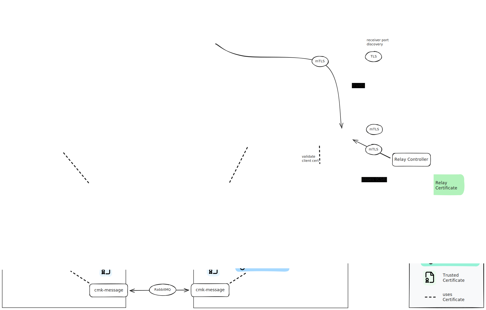

====================
Certificates
====================

Architecture
============

.. Note: you can edit this image by uploading the file to excalidraw

Certificates
------------

Apache HTTPS Certificate
^^^^^^^^^^^^^^^^^^^^^^^^
* User-provided
* Not accessible by site

.. _agentca:

Agent Signing CA
^^^^^^^^^^^^^^^^

* Created by omd
* `etc/ssl/agents/ca.pem`
* Public key / certificate duplicated in `etc/ssl/agent_cert_store.pem`
* Must be a CA
* Signs the agent certs
* Customers are allowed to replace with their own certificate (see `Werk #14965 <https://checkmk.com/werk/14965>`__).

.. _relayca:

Relay Signing CA
^^^^^^^^^^^^^^^^

* Created by omd
* `etc/ssl/agents/ca.pem`
* Public key / certificate duplicated in `etc/ssl/agent_cert_store.pem`
* Must be a CA
* Signs the relay certs

Site Local CA
^^^^^^^^^^^^^

* Created by omd
* `etc/ssl/ca.pem`
* Public key duplicated in

  * `etc/ssl/sites/<site>.pem`
  * `etc/ssl/agent_cert_store.pem`
  * `etc/check_mk/multisite.d/wato/ca-certificates.mk`
  * `var/ssl/remote_sites_cas/<site>.pem`
  * `var/ssl/ca-certificates.crt`
  * `etc/check_mk/multisite.d/wato/ca-certificates.mk` on remote sites
  * `var/ssl/ca-certificates.crt` on remote sites
  * `registered_connections.json` on hosts
  * somewhere on relay?

* Must be a CA
* Signs the site certificates

.. _sitecertificate:

Site Certificate
^^^^^^^^^^^^^^^^^

* Created by omd
* `etc/ssl/sites/<site>.pem`
* Used by `omd/packages/stunnel/skel/etc/stunnel/server.conf`

Agent Certificate
^^^^^^^^^^^^^^^^^

* Created by REST API, issued by Agent Signing CA (:ref:`agentca`)
* Stored in the connection configuration of the agent
* Validated by the agent-receiver and the fetcher to authenticate an agent

Central Msg Broker CA
^^^^^^^^^^^^^^^^^^^^^

* Created by omd
* Ultimate with multi-tenancy: `etc/rabbitmq/ssl/multisite/$customer-name/ca_{key,cert}.pem`
* Other editions: `etc/rabbitmq/ssl/multisite/ca_{key,cert}.pem`
* Public key duplicated in `etc/rabbitmq/ssl/trusted_cas.pem` (also on remote sites)
* Must be a CA
* Signs the local and remote site certs
* Central site sends CA and certs to remote sites, only stores locally the public key of the remote site

Msg Broker Certificate
^^^^^^^^^^^^^^^^^^^^^^

* Created by omd
* Ultimate with multi-tenancy: `etc/rabbitmq/ssl/multisite/$customer-name/$site-name_cert.pem` (TODO validate)
* other editions: `etc/rabbitmq/ssl/multisite/$site-name_cert.pem` (TODO validate)
* Used by RabbitMQ broker to authenticate the connections

Interface agent controller - agent-receiver/fetcher
---------------------------------------------------

Pull-mode:
^^^^^^^^^^
* Fetcher provides certificate (:ref:`sitecertificate`)
* agent controller has cert signed by :ref:`agentca`.

Push-mode:
^^^^^^^^^^

* agent-receiver has cert :ref:`sitecertificate`
* agent controller provides cert signed by :ref:`agentca`.

Interface relay-engine - agent-receiver
---------------------------------------------------

* agent-receiver has cert :ref:`sitecertificate`
* relay-engine provides cert signed by :ref:`relayca`.
