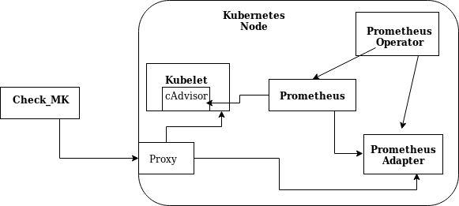

# Kubernetes Monitoring

## Disclaimer
These are internal notes. Please refer to the official documentation on <https://docs.checkmk.com>

## Intro 

Prometheus has become the standard software to monitor a kubernetes
cluster. It runs in its own container and (unfortunately) every application
that needs to use it ends up configuring its own instance of prometheus.

A very informative document on monitoring architecture for kubernetes can
be found here
<https://github.com/kubernetes/community/blob/master/contributors/design-proposals/instrumentation/monitoring_architecture.md>

## Checkmk monitoring idea for kubernetes

Because getting information out of a kubernetes cluster requires going
through a metrics pipeline we need to setup various components in the
system.

-   **Prometheus:** Scrapes the data from monitoring agent: Mainly the Kubelet,
    but services and applications can be setup to output
    metrics in the Prometheus protocol for targeted monitoring
-   **Prometheus Operator:** Manages Prometheus, just a piece of software that
    allows for a simpler and dynamical operation of Prometheus. It answers
    the needs of reloading configurations and restarting services under
    its management.
-   **Prometheus adapter:** Offers an API endpoint to query the metrics that
    have been scraped by Prometheus.
-   **Check\_MK special agent:** Queries the kubelet API or the adapter for metrics

The usable yaml files to fire up a prometheus instance, managed by a
prometheus operator and that monitors the kubelet service are in
this directory, just apply it.

The adapter to expose custom metrix is also available.
I need to pack all this configuration into a check\_mk namespace.

### TODO Secure communication

All Prometheus related containers, pods, services and roles run inside the
kubernetes node. For the moment one abuses that confinement and allow for
insecure communication. This confinement does not mean any application
cannot eavesdrop the communication, it just mean from the outside one needs
a proxy to access it. The configuration to let internal communication
happen through TLS remains a part to deal with, those features are
supported, we need to deal with dealing with the certificates and other
nuances of encryption and authentication.

## Configuring Monitoring architecture

The data delivered by the kubelet API and the Prometheus adapter augments
the basic monitoring of Kubernetes via Check_MK. Therefore, as a first step
the setup of the basic monitoring is necessary. A detailled description of
the setup can be found here
<https://docs.checkmk.com/master/en/monitoring_kubernetes.html>

### Instantiate system

Apply the configuration files in doc/treasures/kubernetes/.

    kubectl apply -f doc/treasures/kubernetes/check_mk_rbac.yaml
    kubectl apply -f doc/treasures/kubernetes/prometheus-operator.yaml
    kubectl apply -f doc/treasures/kubernetes/sample-prometheus-instance.yaml
    kubectl apply -f doc/treasures/kubernetes/custom-metrics.yaml

The order is important, as each configuration installs the dependencies for
the following services, thus a wait for install period is necessary between
each command.
Verify that the prometheus service is running. It should be exposed at <http://clusterip:30999>
Verify that the configuration is correctly loaded and that the targets,
e.g. the kubelet system are being parsed. Also verify that the
custom-metrics api is offering data.

    kubectl get --raw "/apis/custom.metrics.k8s.io/v1beta1/" | jq . | head -n 20

    {
      "kind": "APIResourceList",
      "apiVersion": "v1",
      "groupVersion": "custom.metrics.k8s.io/v1beta1",
      "resources": [
        {
          "name": "pods/spec_memory_limit_bytes",
          "singularName": "",
          "namespaced": true,
          "kind": "MetricValueList",
          "verbs": [
            "get"
          ]
        },
        {
          "name": "nodes/http_request_duration_microseconds_sum",
          "singularName": "",
          "namespaced": true,
          "kind": "MetricValueList",
          "verbs": [

# check\_mk special agent

To test the special agent from the terminal, use in the omd site environment

    share/check_mk/agents/special/agent_kubernetes --port 8443 --no-cert-check --token  "${token_secret}" $(minikube ip)
